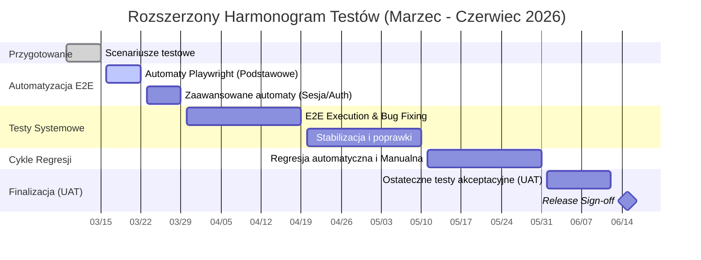

# PLAN TESTÓW: MualaFuel-OnlineShop

## 1. Wprowadzenie
MualaFuel-OnlineShop to platforma e-commerce składająca się z backendu opartego na architekturze Spring Boot oraz frontendu stworzonego w React (Vite). System obsługuje krytyczne procesy biznesowe: autoryzację użytkowników, zarządzanie asortymentem, koszyk zakupowy, proces zamówień oraz audytowanie działań. Niniejszy dokument określa ramy kontroli jakości dla obu modułów.

## 2. Cele
*   **Weryfikacja poprawności biznesowej:** Upewnienie się, że użytkownik może przejść pełną ścieżkę zakupową (od rejestracji po potwierdzenie zamówienia).
*   **Zapewnienie bezpieczeństwa:** Weryfikacja mechanizmów JWT, ról (Admin/User) oraz audytowania operacji.
*   **Stabilność integracji:** Potwierdzenie bezbłędnej komunikacji między frontendem React a REST API.
*   **Minimalizacja długu technicznego:** Utrzymanie wysokiego pokrycia testami automatycznymi w warstwie DAO i Service. (85% pokrycia testami)

## 3. Zakres
### Wchodzi w zakres:
*   **Moduł Autoryzacji:** Rejestracja, logowanie, zabezpieczenie tras (Protected Routes).
*   **Zarządzanie Produktami:** CRUD produktów, wyszukiwanie, filtrowanie, upload zdjęć.
*   **Proces Zakupowy:** Zarządzanie koszykiem (Redux), składanie zamówień, statusy zamówień.
*   **Administracja:** Panel zarządzania zamówieniami, historia e-maili.
*   **Aspekty techniczne:** Walidacja API, audytowanie (AspectJ), obsługa wyjątków.

## 4. Strategie testowania i typy testów
Zastosujemy piramidę testów w celu optymalizacji kosztów i czasu:

1.  **Testy Jednostkowe (Unit Tests):**
    *   JUnit 5 + Mockito. Skupienie na logice w `Service` oraz mapowaniu `Dto/Mapper`.
2.  **Testy Integracyjne:**
    *   Weryfikacja warstwy DAO z bazą testową (Testcontainers).
4.  **Testy E2E (End-to-End):**
    *   Automatyzacja kluczowych ścieżek (Happy Path) przy użyciu Playwright (np. proces zakupu).
5.  **Testy Manualne (Eksploracyjne):**
    *   Weryfikacja UX/UI, responsywności (Tailwind CSS) oraz testowanie negatywne (wprowadzanie błędnych danych).

## 5. Środowisko testowe
*   **Backend:** Java 17+, Maven, baza danych PostgreSQL (konteneryzacja przez Docker/Compose).
*   **Frontend:** Node.js, środowisko Vite (development proxy do backendu).
*   **CI/CD:** GitHub Actions (automatyczne uruchamianie testów przy każdym Pull Requeście).

## 6. Harmonogram
1.  **Faza 1 (Przygotowanie):** Scenariusze testowe (do 15.03).
2.  **Faza 2 (Automatyzacja):** Podstawowe testy Playwright (do 22.03) oraz zaawansowane (sesja/autoryzacja) (do 29.03).
3.  **Faza 3 (System/E2E):** Intensywne testy i stabilizacja (do 19.04).
4.  **Faza 4 (Długofalowa Jakość):** Cykle regresji, testy wydajnościowe i UAT (Maj - Czerwiec).

## 7. Kryteria wejścia/wyjścia
### Kryteria wejścia:
*   Ukończona implementacja danej funkcjonalności.
*   Brak błędów kompilacji (Backend & Frontend).
*   Dostępne środowisko testowe (Database + API).

### Kryteria wyjścia:
*   100% testów regresji zakończonych sukcesem.
*   Brak otwartych błędów o priorytecie "Critical" i "High".
*   Pokrycie kodu testami (Code Coverage) na poziomie min. 70% dla logiki biznesowej.

## 8. Role i odpowiedzialności
*   **QA Lead (Szef QA):** Nadzór nad strategią, zarządzanie ryzykiem, raportowanie do interesariuszy.
*   **Manual QA:** Testy eksploracyjne, pisanie scenariuszy testowych, raportowanie błędów.
*   **Automation Engineer (lub Developer):** Tworzenie i utrzymanie skryptów E2E, konfiguracja CI/CD.
*   **Developers:** Pisanie testów jednostkowych i integracyjnych, naprawa zgłoszonych błędów.

## 9. Ryzyka
1.  **Niestabilność API:** Zmiany w kontraktach backendu mogą psuć frontend.
2.  **Zależności zewnętrzne:** Problemy z serwerem SMTP dla e-maili.
3.  **Zasoby ludzkie:** Problemy z dostępnością doświadczonych Automation Engineers
